# 🐝 BeeWatch — Smart Hive Integrated Monitoring System

BeeWatch adalah sistem pemantauan sarang lebah cerdas berbasis **IoT + Machine Learning** yang mendeteksi anomali kondisi sarang secara *real-time* menggunakan dua modalitas: **sensor lingkungan** (suhu, kelembaban, tekanan) dan **audio akustik** dari dalam sarang. Sistem ini dibangun di atas dua node ESP32 yang bekerja secara paralel, mengirimkan data ke server Flask yang menjalankan dua model autoencoder untuk menghasilkan satu *combined anomaly score*.

---

## Daftar Isi

1. [Arsitektur Sistem](#arsitektur-sistem)
2. [Firmware ESP32](#firmware-esp32)
3. [Server Flask](#server-flask)
4. [Model Machine Learning — Sensor](#model-sensor-autoencoder)
5. [Model Machine Learning — Audio](#model-audio-autoencoder)
6. [Penggabungan Skor](#penggabungan-skor-combined-score)
7. [Notifikasi Telegram](#notifikasi-telegram)
8. [Struktur Proyek](#struktur-proyek)
9. [Instalasi & Menjalankan Server](#instalasi--menjalankan-server)
10. [API Endpoint](#api-endpoint)
11. [Training Model](#training-model)
12. [Dependensi](#dependensi)

---

## Arsitektur Sistem

```
┌─────────────────────┐      ┌─────────────────────┐
│   ESP32 Sensor Node │      │   ESP32 Audio Node  │
│                     │      │                     │
│  BME280             │      │  INMP441 (I2S mic)  │
│  suhu / kelembaban  │      │  rekam WAV 1 menit  │
│  / tekanan          │      │  setiap 15 menit    │
└────────┬────────────┘      └──────────┬──────────┘
         │  POST /upload/sensor          │  POST /upload/audio
         │  (JSON)                       │  (multipart WAV)
         └──────────────┬────────────────┘
                        │
               ┌────────▼────────┐
               │  Flask Server   │
               │   (app.py)      │
               │                 │
               │  Sensor AE  ────┤──► sensor_score
               │  Audio AE   ────┤──► audio_score
               │                 │
               │  Combined Score │
               │  (50:50 weighted│
               │   dalam ±5 mnt) │
               └────────┬────────┘
                        │
           ┌────────────┼────────────┐
           │                         │
    ┌──────▼──────┐         ┌────────▼────────┐
    │  SQLite DB  │         │  Telegram Bot   │
    │ (beewatch   │         │  📊 Laporan     │
    │   .db)      │         │  🚨 Alert       │
    └─────────────┘         └─────────────────┘
```

### Alur Deteksi Anomali

1. **ESP32 Sensor** membaca BME280 setiap interval dan mengirim JSON ke `/upload/sensor`
2. **ESP32 Audio** merekam audio 1 menit via INMP441, mengonversinya ke WAV, lalu mengirim ke `/upload/audio`
3. Server menyimpan pembacaan sensor dan audio terbaru; keduanya digabungkan jika selisih waktu ≤ 5 menit
4. `combined_score = 0.5 × sensor_score + 0.5 × audio_score`
5. Jika `combined_score > 0.5` → **status ANOMALI**, laporan dikirim ke Telegram
6. Jika anomali terdeteksi N kali berturut-turut (default: 2) → **alert darurat** dikirim

---

## Firmware ESP32

Firmware tersimpan di folder `firmware/` dan ditulis untuk **Arduino IDE** (`.ino`). Kedua node bekerja secara independen dan mengirim data ke server Flask yang sama.

### Sensor Node (`firmware/sensor_node/sensor_node.ino`)

**Hardware:** ESP32-B + BME280

**Wiring BME280 → ESP32:**

| BME280 | Keterangan | ESP32 |
|---|---|---|
| VIN | Catu daya | 3.3V |
| GND | Ground | GND |
| SDA | I2C Data | GPIO 25 |
| SCL | I2C Clock | GPIO 26 |

> Pin SDO → GND: alamat I2C `0x76` | Pin SDO → 3.3V: alamat I2C `0x77`

**Konfigurasi utama:**

| Parameter | Nilai | Keterangan |
|---|---|---|
| `INTERVAL_MS` | 15 menit | Interval kirim ke server |
| `PRESSURE_OFFSET` | 89.0 hPa | Offset kalibrasi tekanan (sesuaikan lokasi) |
| `WIFI_MAX_RETRY` | 5 | Maks percobaan ulang koneksi WiFi |
| `HTTP_MAX_RETRY` | 3 | Maks percobaan ulang HTTP POST |
| `HTTP_RETRY_DELAY` | 3000 ms | Jeda antar percobaan HTTP |

**Alur kerja (setiap 15 menit):**
1. Baca suhu, kelembaban, tekanan dari BME280
2. Terapkan offset kalibrasi tekanan (`pressure + PRESSURE_OFFSET`)
3. HTTP POST JSON ke Flask `/upload/sensor`
4. Tunggu 15 menit, ulangi

**Payload JSON yang dikirim:**
```json
{
  "temperature": 35.5,
  "humidity": 62.3,
  "pressure": 1008.1
}
```

**Konfigurasi wajib diubah sebelum flash:**
```cpp
#define WIFI_SSID      "nama_wifi"          // ganti dengan SSID Anda
#define WIFI_PASSWORD  "password_wifi"       // ganti dengan password Anda
#define SERVER_URL     "http://<IP_SERVER>:5000/upload/sensor"  // IP server Flask
```

**Library yang dibutuhkan (Arduino IDE):**
- `WiFi.h` (bawaan ESP32 core)
- `HTTPClient.h` (bawaan ESP32 core)
- `ArduinoJson` by Benoit Blanchon
- `Adafruit BME280 Library`

---

### Audio Node (`firmware/audio_node/audio_node.ino`)

**Hardware:** ESP32-A + INMP441

**Wiring INMP441 → ESP32:**

| INMP441 | Keterangan | ESP32 |
|---|---|---|
| VDD | Catu daya | 3.3V |
| GND | Ground | GND |
| WS | Word Select (LRCK) | GPIO 15 |
| SCK | Serial Clock (BCLK) | GPIO 14 |
| SD | Serial Data | GPIO 32 |
| L/R | Channel select (kiri) | GND |

> **Penting sebelum upload:** Ubah partition scheme di Arduino IDE:
> `Tools → Partition Scheme → No OTA (2MB APP / 2MB SPIFFS)`

**Konfigurasi utama:**

| Parameter | Nilai | Keterangan |
|---|---|---|
| `SAMPLE_RATE` | 16.000 Hz | Harus sama dengan konfigurasi model audio |
| `RECORD_SECONDS` | 30 detik | Durasi rekaman per siklus |
| `INTERVAL_MINUTES` | 15 menit | Interval antar siklus rekam-kirim |
| `WAV_PATH` | `/beewatch.wav` | Path file di SPIFFS |
| `HTTP_TIMEOUT_MS` | 90.000 ms | Timeout upload (file WAV besar) |
| `I2S_PORT` | `I2S_NUM_0` | Port I2S yang digunakan |
| `LED_PIN` | GPIO 2 | LED indikator bawaan ESP32 |

**Alur kerja (setiap 15 menit):**
1. Rekam 30 detik audio dari INMP441 via I2S
2. Simpan ke SPIFFS sebagai `beewatch.wav` (16-bit PCM, mono, 16 kHz)
3. HTTP POST multipart ke Flask `/upload/audio`
4. Hapus file WAV dari SPIFFS
5. Tunggu sisa interval 15 menit, ulangi

**LED indikator:**
- Berkedip cepat (100 ms): Error SPIFFS atau I2S saat startup
- Berkedip normal (200 ms): Error I2S saat startup
- Mati setelah kirim: Siklus selesai, menunggu interval

**Konfigurasi wajib diubah sebelum flash:**
```cpp
#define WIFI_SSID      "nama_wifi"          // ganti dengan SSID Anda
#define WIFI_PASSWORD  "password_wifi"       // ganti dengan password Anda
#define SERVER_HOST    "<IP_SERVER>"         // IP server Flask
#define SERVER_PORT    5000
```

**Library yang dibutuhkan (Arduino IDE):**
- `WiFi.h` (bawaan ESP32 core)
- `SPIFFS.h` (bawaan ESP32 core)
- `driver/i2s.h` (bawaan ESP32 core)

---

## Server Flask

Server dijalankan dari `server/app.py` menggunakan Flask. Terdiri dari 4 modul:

| File | Fungsi |
|---|---|
| `app.py` | Entry point Flask, endpoint HTTP, logika *combined score* dan *streak* anomali |
| `inference.py` | Kelas `BeeWatchInference` — memuat kedua model dan menghitung skor |
| `database.py` | Inisialisasi SQLite dan pencatatan setiap pembacaan |
| `notifier.py` | `TelegramNotifier` — mengirim laporan rutin dan peringatan darurat |

Konfigurasi server melalui file `server/.env`:

```env
TELEGRAM_BOT_TOKEN=<token_bot_telegram_anda>
TELEGRAM_CHAT_ID=<chat_id_tujuan>
PORT=5000
ANOMALY_CONSECUTIVE_COUNT=2
```

---

## Model Sensor Autoencoder

> Notebook training: `sensor_training.ipynb`

### Dataset

- **Sumber:** [Kaggle — Beehive Sounds (annajyang)](https://www.kaggle.com/datasets/annajyang/beehive-sounds)
- **File:** `all_data_updated.csv` — 1.275 baris data lingkungan sarang dari 4 koloni lebah madu Eropa
- **Fitur yang digunakan:** `hive temp`, `hive humidity`, `hive pressure` (3 fitur; `hive weight` tidak digunakan)
- **Pendekatan:** Unsupervised — label `target` tidak digunakan saat training, hanya untuk referensi evaluasi

### Distribusi Fitur Sensor

Distribusi ketiga fitur sensor menunjukkan rentang kondisi sarang yang normal. Suhu berkisar 15–55 °C dengan puncak di ~28 °C, kelembaban 15–90 %RH, dan tekanan 1004–1016 hPa.

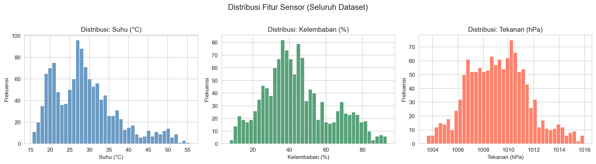

### Analisis Korelasi Sensor

Scatter matrix antar-fitur menunjukkan korelasi negatif antara suhu dan kelembaban — kondisi yang diharapkan pada sarang lebah aktif.

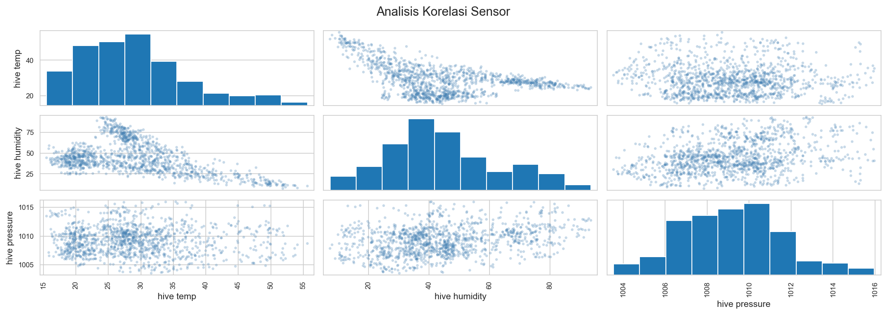

### Arsitektur Model

Model sensor menggunakan **autoencoder simetris** dengan bottleneck 2 dimensi (sengaja kecil agar mudah divisualisasikan):

```
Input (3)
   └─► Dense(16) + ReLU
           └─► Dense(8) + ReLU
                   └─► Dense(2)  ← BOTTLENECK
                           └─► Dense(8) + ReLU
                                   └─► Dense(16) + ReLU
                                           └─► Output (3)
```

- **Optimizer:** Adam (lr = 0.001)
- **Loss:** MSE
- **Scaler:** StandardScaler (fit hanya di data train, disimpan ke `sensor_scaler.pkl`)
- **Threshold anomali:** Persentil 95 reconstruction error pada data train

### Kurva Training Sensor

Model konvergen dengan baik pada epoch ke-123 (ditentukan oleh EarlyStopping, patience=20). Validation loss konsisten di bawah training loss — tidak ada overfitting.

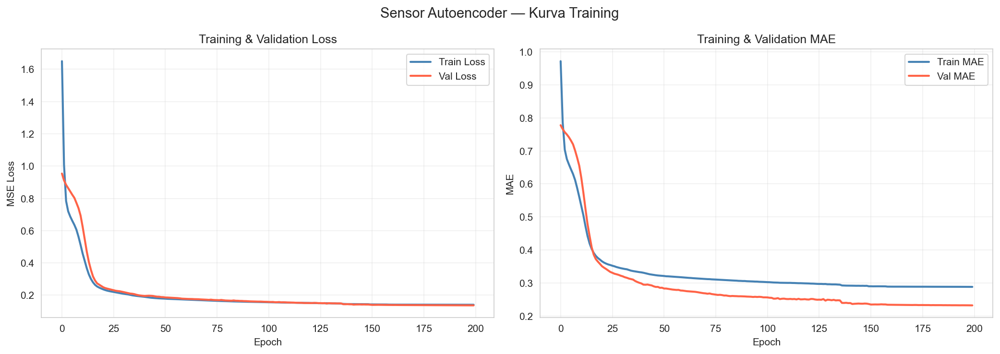

### Distribusi Reconstruction Error Sensor

Sebagian besar sampel memiliki error rendah (dekat nol). Threshold P95 = **0.3848** berarti hanya 5% sampel dengan error tertinggi yang diklasifikasikan sebagai anomali.

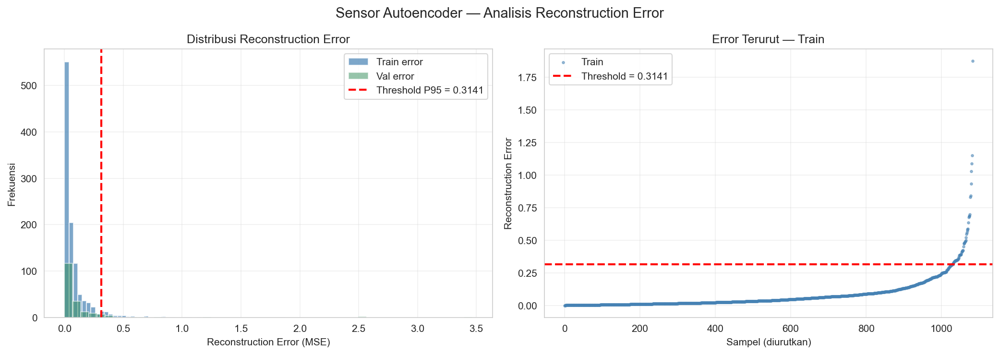

### Evaluasi Sensor Autoencoder

Panel kiri menunjukkan distribusi error train vs val yang hampir identik — model tidak overfit. Panel kanan memperlihatkan representasi bottleneck 2D diwarnai berdasarkan reconstruction error: sampel dengan error tinggi (merah/pink) tampak terisolasi di tepi kiri cluster, mengkonfirmasi bahwa model belajar memisahkan kondisi anomali.

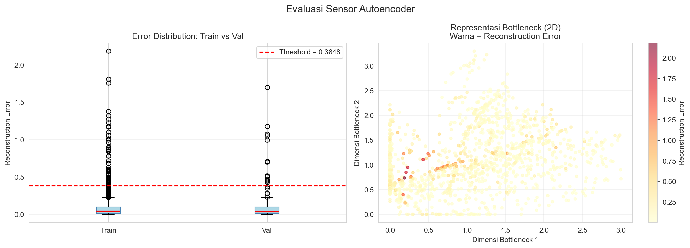

### Visualisasi Bottleneck Sensor

Representasi bottleneck 2D diwarnai per kelas target (0–5, status koloni lebah). Meski training dilakukan secara unsupervised, bottleneck secara alami mengelompokkan kondisi sarang yang berbeda — validasi bahwa model mempelajari pola bermakna.

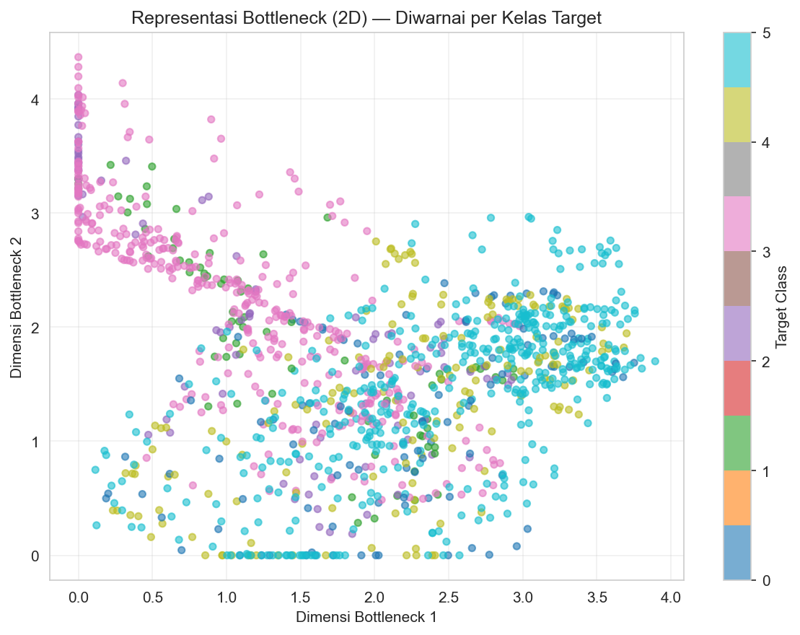

### Artefak Output

| File | Fungsi |
|---|---|
| `sensor_autoencoder.keras` | Model Keras untuk inferensi di server |
| `sensor_scaler.pkl` | StandardScaler yang di-fit pada data train |
| `sensor_threshold.npy` | Nilai threshold P95 rekonstruksi error |

---

## Model Audio Autoencoder

> Notebook training: `audio_training.ipynb` (dijalankan di Kaggle Notebook, GPU T4)

### Dataset

- **Sumber:** [Kaggle — Beehive Sounds (annajyang)](https://www.kaggle.com/datasets/annajyang/beehive-sounds)
- **File audio:** 7.100 file WAV dari 4 koloni lebah madu Eropa, rekaman ~1 menit setiap 15 menit
- **Pendekatan:** Unsupervised murni — semua file WAV dianggap representasi pola "normal" untuk belajar

### Ekstraksi Fitur Audio (72 Dimensi)

Setiap file WAV dipotong menjadi segmen 2 detik (SR = 16.000 Hz). Dari tiap segmen diekstrak fitur akustik, lalu dirata-rata lintas segmen:

| Fitur | Paramater | Dimensi |
|---|---|---|
| MFCC mean | 13 koefisien | 13 |
| MFCC std | 13 koefisien | 13 |
| Mel-Spectrogram mean | 20 band dari 128 mel | 20 |
| Mel-Spectrogram std | 20 band dari 128 mel | 20 |
| Spectral Centroid mean + std | — | 2 |
| Spectral Rolloff mean + std | — | 2 |
| Zero Crossing Rate mean + std | — | 2 |
| **Total** | | **72** |

Parameter ekstraktor: `n_fft=512`, `hop_length=256`, `n_mels=128`

### Distribusi Fitur Audio (MFCC)

Distribusi 12 koefisien MFCC pertama menunjukkan bentuk distribusi yang relatif normal dan simetris setelah normalisasi — kondisi yang baik untuk pelatihan autoencoder.

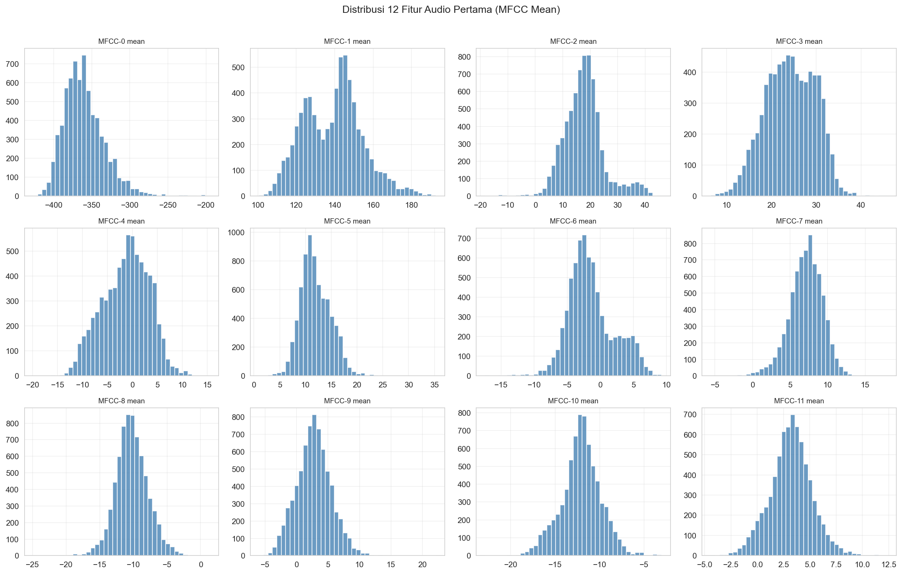

### PCA Fitur Audio — Sebelum Normalisasi

Sebelum normalisasi, PC1 mendominasi 98,3% variance karena perbedaan skala antar-fitur yang besar. Ini mengkonfirmasi perlunya StandardScaler sebelum training.

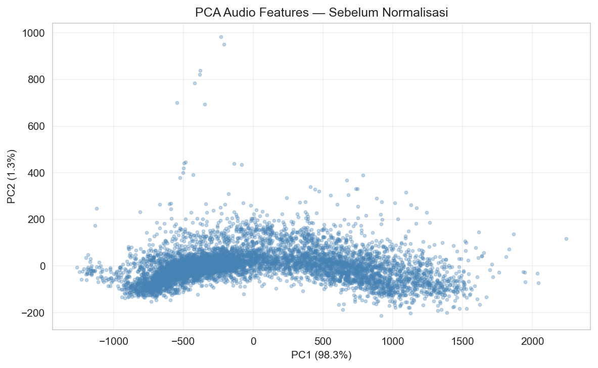

### Arsitektur Model

Model audio menggunakan **progressive compression** dengan bottleneck 32 dimensi:

```
Input (72)
   └─► Dense(64) + BatchNorm + ReLU + Dropout(0.1)
           └─► Dense(32)  ← BOTTLENECK (aktivasi ReLU)
                   └─► Dense(64) + BatchNorm + ReLU + Dropout(0.1)
                           └─► Output (72)
```

- **Optimizer:** Adam (lr = 0.001), dengan `ReduceLROnPlateau` (factor=0.5, patience=8)
- **Loss:** MSE
- **Split:** 80% train / 20% val
- **Max epochs:** 250, dihentikan oleh `EarlyStopping` (patience=20)

### Kurva Training Audio

Model konvergen pada epoch ke-180. Validation loss (merah) berada di bawah training loss — menunjukkan tidak ada overfitting. Penurunan loss yang mulus mengkonfirmasi bahwa arsitektur progressive compression bekerja dengan baik untuk data akustik 72 dimensi.

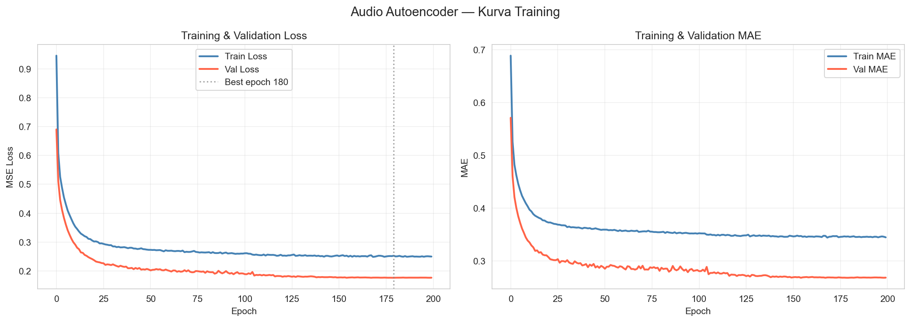

### Distribusi Reconstruction Error Audio

Panel kiri: distribusi error sangat right-skewed — sebagian besar sampel memiliki error sangat rendah, dengan ekor panjang di kanan. Threshold P95 = **0.6127**.

Panel kanan: kurva error yang diurutkan (sorted error curve) — bentuk kurva "hockey stick" yang ideal, di mana error naik tajam hanya pada 5% sampel terakhir.

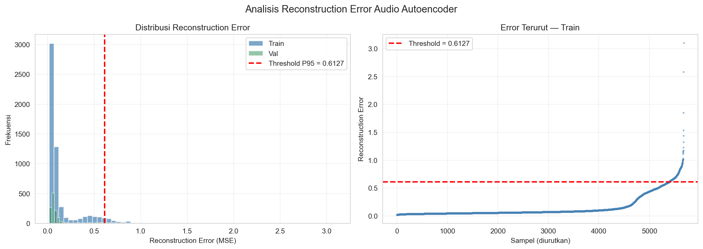

### Evaluasi Audio Autoencoder

Panel kiri (boxplot): distribusi error train dan val hampir identik dengan median mendekati 0, mengkonfirmasi tidak ada overfitting. Outlier di atas threshold merupakan sampel yang akan diklasifikasikan sebagai anomali.

Panel kanan: distribusi audio anomaly score (0–1). Sebagian besar sampel mendapat skor mendekati 0 (normal). Threshold score = **0.8108** — hanya sampel dengan skor di atas ini yang memicu notifikasi.

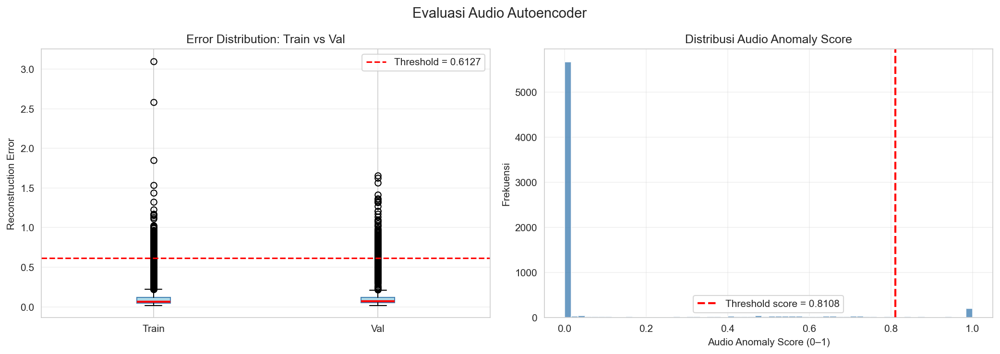

### Visualisasi Bottleneck Audio (PCA 32D → 2D)

Representasi ruang laten 32 dimensi diproyeksikan ke 2D menggunakan PCA (PC1 = 31,9%, PC2 = 10,5%). Sampel normal (kuning muda) membentuk cluster padat di kiri, sementara sampel anomali (merah/oranye) memencar ke kanan — bukti bahwa model berhasil mempelajari manifold pola akustik normal.

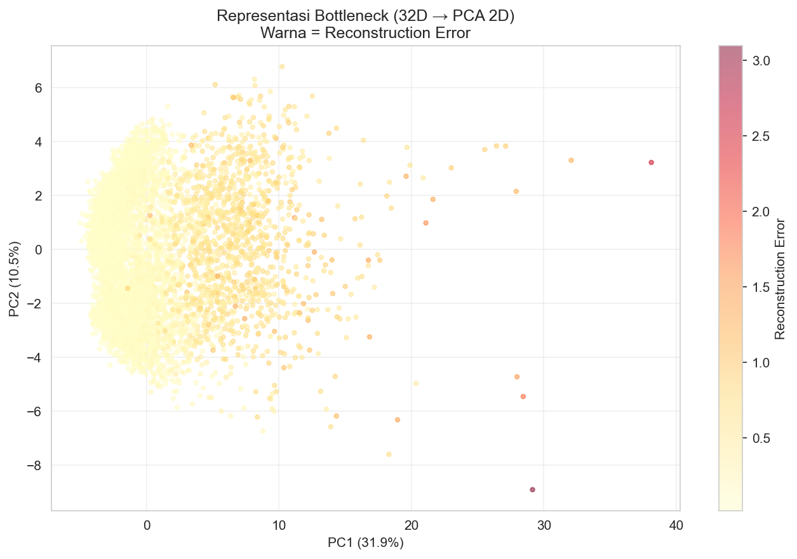

### Artefak Output

| File | Fungsi |
|---|---|
| `audio_autoencoder.keras` | Model Keras untuk inferensi di server |
| `audio_scaler.pkl` | StandardScaler yang di-fit pada 7.100 sampel audio |
| `model_config.pkl` | Konfigurasi ekstraksi fitur (SR, N_MFCC, N_MELS, N_FFT, dll.) |
| `thresholds.pkl` | Threshold P95, mean, dan std reconstruction error |

---

## Penggabungan Skor (Combined Score)

Setelah kedua pembacaan (sensor + audio) tersedia dalam jendela waktu 5 menit, server menghitung:

```
sensor_score  = clip(sensor_error / sensor_threshold, 0.0, 1.0)

z             = (audio_raw_error - audio_mean) / (audio_std + ε)
audio_score   = clip(z / 6.0 + 0.5, 0.0, 1.0)

combined_score = 0.5 × sensor_score + 0.5 × audio_score
is_anomaly     = combined_score > 0.5
```

- **`sensor_score`**: error sensor dinormalisasi relatif terhadap threshold (0 = sempurna normal, 1 = setara threshold atau lebih)
- **`audio_score`**: Z-score audio error, di-mapping ke [0,1] sehingga error = mean → score = 0.5, error = mean + 3σ → score ≈ 1.0
- Kedua skor diberi bobot **50:50**

Setelah combined score dihitung, buffer `latest_sensor` dan `latest_audio` direset — setiap pasangan hanya diproses sekali.

### Logika Streak & Alert Darurat

```
anomaly_streak += 1  (setiap anomali)
anomaly_streak  = 0  (setiap normal)

if anomaly_streak >= ANOMALY_CONSECUTIVE_COUNT:
    → kirim emergency alert
    → reset streak ke 0
```

---

## Notifikasi Telegram

Server mengirim dua jenis pesan:

**📊 Laporan Rutin** — dikirim setiap combined score berhasil dihitung:

```
📊 [BeeWatch] Laporan Rutin
🕐 Waktu          : 2025-01-01 10:00:00
🌡️ Suhu           : 35.5 °C
💧 Kelembaban     : 62.3 %RH
📈 Tekanan        : 1008.1 hPa
🌿 Sensor Score   : 0.3200
🔊 Audio Score    : 0.2800
⚖️ Combined Score : 0.3000
📌 Status         : ✅ NORMAL
```

**🚨 Peringatan Darurat** — dikirim saat anomali terdeteksi N kali berturut-turut:

```
🚨 [BeeWatch] PERINGATAN ANOMALI
🕐 Waktu          : 2025-01-01 10:15:00
...
❗ Status          : ANOMALI TERDETEKSI
🔍 Rekomendasi    : Segera periksa kondisi sarang Anda.
```

---

## Struktur Proyek

```
beewatch/
├── firmware/
│   ├── sensor_node/
│   │   └── sensor_node.ino     # Firmware ESP32 + BME280 (sensor suhu/kelembaban/tekanan)
│   └── audio_node/
│       └── audio_node.ino      # Firmware ESP32 + INMP441 (perekam audio WAV)
├── server/
│   ├── app.py                  # Flask server, endpoint HTTP, logika combined score
│   ├── inference.py            # Kelas BeeWatchInference (load model + hitung skor)
│   ├── database.py             # Inisialisasi & logging SQLite
│   ├── notifier.py             # Telegram bot (laporan rutin & peringatan darurat)
│   └── .env                    # Konfigurasi rahasia (token, port, dll.)
├── training/
│   ├── sensor_training.ipynb   # Notebook training Sensor Autoencoder
│   ├── audio_training.ipynb    # Notebook training Audio Autoencoder (Kaggle GPU)
│   ├── sensor_distribution.png
│   ├── sensor_correlation.png
│   ├── sensor_training_loss.png
│   ├── sensor_error_distribution.png
│   ├── sensor_evaluation.png
│   ├── sensor_bottleneck.png
│   ├── audio_feature_distribution.png
│   ├── audio_pca_raw.png
│   ├── audio_training_loss.png
│   ├── audio_error_distribution.png
│   ├── audio_evaluation.png
│   └── audio_bottleneck_pca.png
├── models/                     # Artefak model (diisi setelah training, tidak di-commit)
│   ├── sensor_autoencoder.keras
│   ├── sensor_scaler.pkl
│   ├── sensor_threshold.npy
│   ├── audio_autoencoder.keras
│   ├── audio_scaler.pkl
│   ├── model_config.pkl
│   └── thresholds.pkl
├── data/                       # SQLite database (dibuat otomatis saat server jalan)
│   └── beewatch.db
├── sensor_training.ipynb       # (copy di root, identik dengan training/)
├── audio_training.ipynb        # (copy di root, identik dengan training/)
└── requirements.txt
```

---

## Instalasi & Menjalankan Server

### Prasyarat

- Python 3.10+
- Artefak model sudah tersedia di folder `models/` (hasil dari training notebook)
- Bot Telegram sudah dibuat dan token tersedia

### Clone & Install Dependensi

```bash
git clone https://github.com/<username>/beewatch.git
cd beewatch
python -m venv venv

# Windows
venv\Scripts\activate
# Linux / macOS
source venv/bin/activate

pip install -r requirements.txt
```

### Konfigurasi

Buat file `server/.env`:

```env
TELEGRAM_BOT_TOKEN=<token_dari_BotFather>
TELEGRAM_CHAT_ID=<chat_id_atau_group_id>
PORT=5000
ANOMALY_CONSECUTIVE_COUNT=2
```

### Jalankan Server

```bash
cd server
python app.py
```

Output saat startup:
```
Loading models...
Sensor threshold : 0.384800
Audio threshold  : 0.612700
All models loaded.
BeeWatch server running on port 5000
```

### Cek Status Server

```bash
curl http://localhost:5000/health
```

---

## API Endpoint

### `POST /upload/sensor`

Menerima data sensor dari ESP32 Sensor Node.

**Request Body (JSON):**
```json
{
  "temperature": 35.5,
  "humidity": 62.3,
  "pressure": 1008.1
}
```

**Response:**
```json
{
  "status": "received",
  "sensor_error": 0.0023,
  "sensor_anomaly": false,
  "waiting_audio": true
}
```

`waiting_audio: true` berarti server menunggu data audio untuk menghitung combined score.

---

### `POST /upload/audio`

Menerima file audio WAV dari ESP32 Audio Node.

**Request:** `multipart/form-data` dengan field `audio` berisi file `.wav`

```bash
curl -X POST http://localhost:5000/upload/audio \
  -F "audio=@recording.wav"
```

**Response:**
```json
{
  "status": "received",
  "audio_score": 0.42,
  "audio_anomaly": false,
  "severity": "normal",
  "waiting_sensor": false
}
```

Nilai `severity`: `normal` | `warning` | `critical`

---

### `GET /health`

Memeriksa status server dan parameter model yang aktif.

**Response:**
```json
{
  "status": "ok",
  "sensor_threshold": 0.384800,
  "audio_threshold": 0.612700,
  "combined_threshold": 0.5,
  "w_sensor": 0.5,
  "w_audio": 0.5,
  "time_window_sec": 300
}
```

---

## Training Model

### Sensor Autoencoder (Lokal)

1. Unduh dataset dari Kaggle: [annajyang/beehive-sounds](https://www.kaggle.com/datasets/annajyang/beehive-sounds)
2. Letakkan `all_data_updated.csv` di `data/sensor_data/`
3. Jalankan `sensor_training.ipynb` dari atas ke bawah
4. Salin artefak ke folder `models/`:
   - `sensor_autoencoder.keras`
   - `sensor_scaler.pkl`
   - `sensor_threshold.npy`

### Audio Autoencoder (Kaggle Notebook — GPU T4)

Ekstraksi fitur dari 7.100 file WAV membutuhkan waktu lama; sangat disarankan menggunakan GPU Kaggle.

1. Buka `audio_training.ipynb` di Kaggle
2. Klik **+ Add Data** → cari `annajyang/beehive-sounds` → tambahkan
3. *(Opsional)* Tambahkan dataset cache `beewatch-cache` untuk skip ekstraksi fitur ulang
4. Klik **Run All**
5. Unduh artefak dari panel *Output* Kaggle, lalu salin ke folder `models/`:
   - `audio_autoencoder.keras`
   - `audio_scaler.pkl`
   - `model_config.pkl`
   - `thresholds.pkl`

> **Catatan cache:** Setelah ekstraksi fitur selesai pertama kali, unduh `audio_features_cache.pkl` dari output Kaggle dan upload sebagai dataset Kaggle bernama `beewatch-cache`. Pada run berikutnya, notebook akan otomatis memuatnya dan melewati proses ekstraksi.

---

## Dependensi

| Paket | Versi |
|---|---|
| tensorflow | 2.18.0 |
| scikit-learn | 1.5.2 |
| numpy | 1.26.4 |
| pandas | 2.2.2 |
| librosa | 0.10.2 |
| flask | 3.0.3 |
| python-telegram-bot | 20.7 |
| python-dotenv | 1.0.1 |
| matplotlib | 3.9.2 |
| seaborn | 0.13.2 |

---

## Lisensi

Proyek ini dilisensikan di bawah ketentuan yang tercantum di file [LICENSE](LICENSE).
